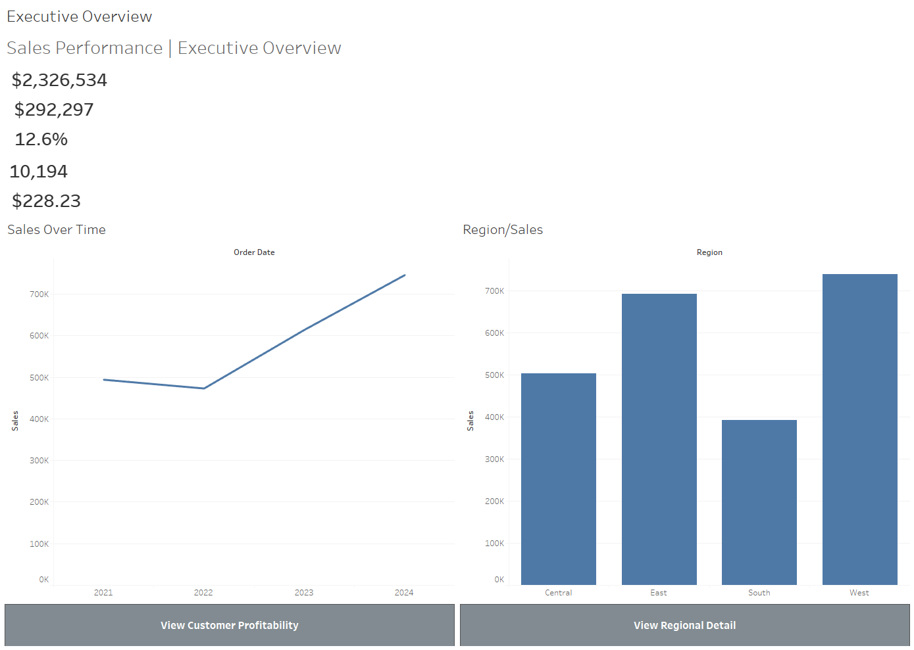
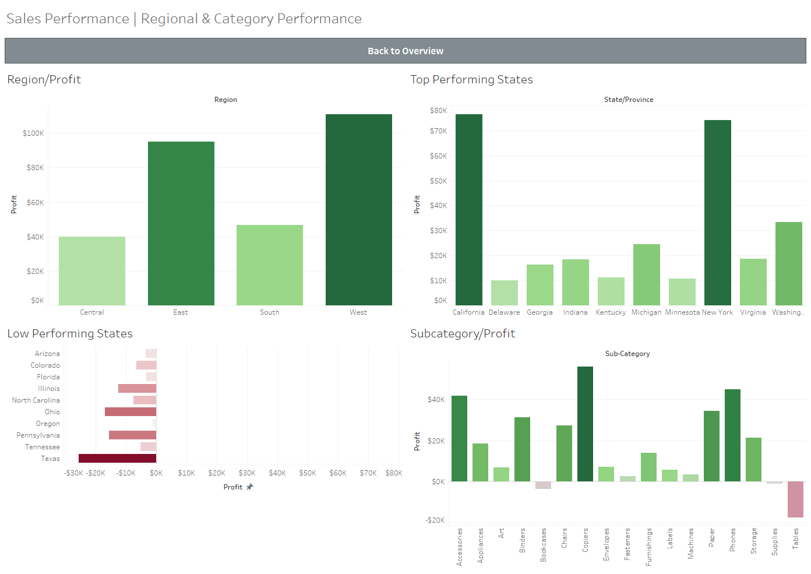
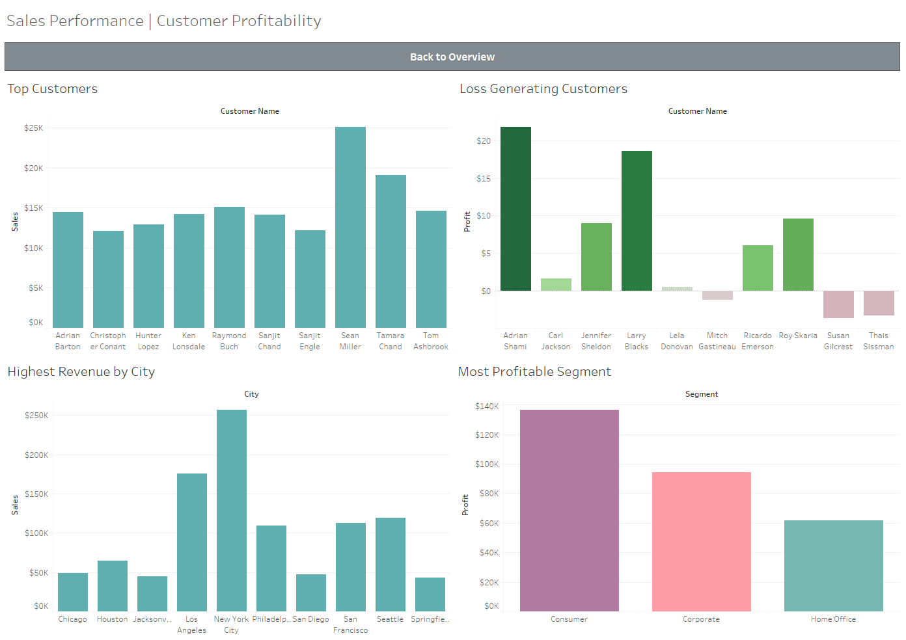

# Sales Performance Dashboard | Tableau 

An interactive Business Intelligence dashboard built in **Tableau** to analyze sales performance, profitability, customer behavior, and regional trends using retail sales data.

---

## Project Overview

This project provides an executive-level view of business performance through interactive dashboards and visual analytics. It enables stakeholders to monitor KPIs, identify profitable customers and products, analyze regional performance, and make data-driven business decisions.

---

## Business Objectives

This dashboard helps answer key business questions such as:

- Which regions generate the highest sales and profit?
- Which customers contribute the most revenue?
- Which products and categories perform best?
- Which states are underperforming?
- How do sales and profits change over time?
- Which customer segments are the most profitable?

---

## Dashboards Included

### Executive Overview

Provides an overall business snapshot including:

- Total Sales
- Total Profit
- Total Orders
- Average Order Value
- Profit Margin
- Monthly Sales Trend
- Monthly Profit Trend
- Top Revenue Categories
- Regional Sales Distribution

---

### Regional & Category Performance

Focuses on geographical and product performance.

Includes:

- Regional Sales
- Regional Profit
- Sales by Category
- Profit by Category
- Quarterly Sales Analysis
- State-wise Performance

---

### Customer Profitability

Designed to identify profitable and loss-making customers.

Includes:

- Top Customers
- Least Profitable Customers
- Customer Profit Analysis
- Sales by Customer Segment
- City-wise Performance
- Sub-category Profitability

---

## Features

- Interactive dashboards
- Executive KPI cards
- Dynamic filters
- Parameter controls
- Dashboard navigation
- Drill-down analysis
- Time-series trend analysis
- Regional performance insights
- Customer profitability analysis
- Product performance analysis

---

## Tools & Technologies

- Tableau Desktop
- Tableau Calculated Fields
- Parameters
- Dashboard Actions
- Filters
- Maps
- Bar Charts
- Line Charts
- KPI Cards
- Data Visualization

---

## Skills Demonstrated

- Business Intelligence
- Dashboard Design
- Data Visualization
- KPI Reporting
- Sales Analytics
- Customer Analytics
- Profitability Analysis
- Executive Reporting
- Interactive Dashboard Development

---

## Repository Structure

```
tableau-sales-performance-dashboard/
│
├── README.md
├── Sales_Performance_Dashboard_Shrinkhla_Sharma.twbx
│
└── screenshots/
    ├── executive-overview.png
    ├── regional-category-performance.png
    └── customer-profitability.png
```

---

## Dashboard Preview

### Executive Overview

 

---

### Regional & Category Performance



---

### Customer Profitability


---

## Business Insights

Some examples of insights that can be derived from this dashboard:

- Identify high-performing regions.
- Detect low-profit products.
- Track monthly sales growth.
- Analyze customer purchasing behavior.
- Compare category performance.
- Discover profitable customer segments.
- Monitor business KPIs in one place.

---

## How to Use

1. Download the `.twbx` file.
2. Open it using Tableau Desktop.
3. Explore each dashboard.
4. Use filters and parameters for interactive analysis.
5. Drill down into different regions, categories, and customer segments.

---

## Author

**Shrinkhla Sharma**

Business Intelligence Analyst

### Skills

- Tableau
- SQL
- Excel
- Business Intelligence
- Data Visualization
- Analytics

